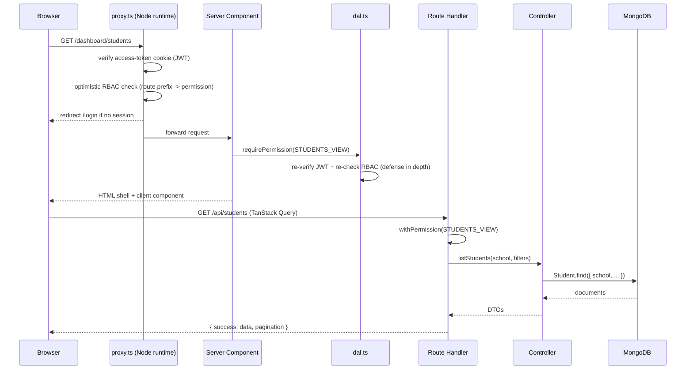
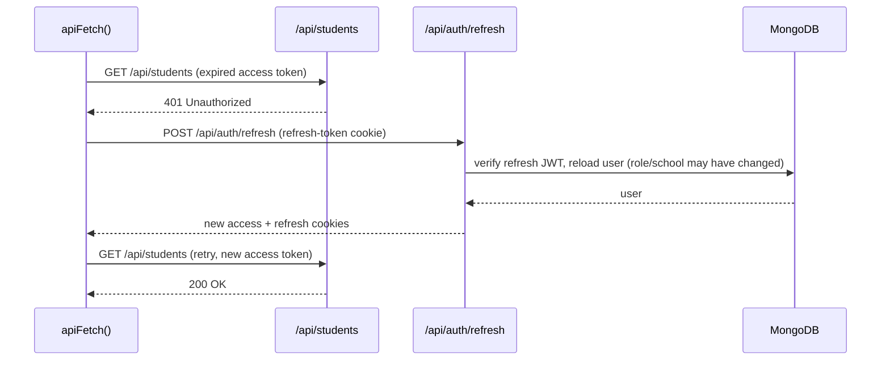

# Architecture

## Layering

JNV Smart Connect follows a strict, one-directional layering so that business
logic never leaks into transport or presentation code:

```
Route (app/api/**/route.ts)
   -> Middleware (withAuth / withPermission / withErrorHandling)
      -> Validator (Zod schema, parses/rejects the request body or query)
         -> Controller (business logic, the only layer that touches models)
            -> Model (Mongoose schema/collection)
```

- **Routes** are thin: parse `req.json()`/`searchParams`, call one Zod schema,
  call one controller function, wrap the result in `ok()`/`paginated()`.
- **Middlewares** (`src/middlewares/with-auth.ts`, `error-handler.ts`) supply
  the authenticated session and turn thrown `ApiError`/`ZodError`/Mongo
  duplicate-key errors into the right HTTP status uniformly.
- **Controllers** (`src/controllers/*.ts`) hold every business rule: uniqueness
  checks, cross-collection invariants (e.g. "a bed can only be actively
  occupied by one student"), `ActivityLog` writes, and school-scoping.
- **Models** (`src/models/*.ts`) are Mongoose schemas only — no business logic,
  only field-level validation, indexes, and `unique`/`partialFilterExpression`
  invariants enforced at the database level as a second line of defense.

Client-facing pages mirror the same shape one level up:

```
Server Component (app/dashboard/**/page.tsx)
   -> requirePermission() / requireSession()   [src/lib/auth/dal.ts]
      -> Client Component (feature UI, "use client")
         -> TanStack Query hook (src/hooks/use-*.ts)
            -> Service (src/services/*.ts, wraps apiFetch)
               -> API route above
```

## Request flow (page load)



## Request flow (silent token refresh)

Access tokens are short-lived (15 min) on purpose. Rather than a background
timer, refresh is reactive: the client's `apiFetch` wrapper retries exactly
once on a `401`, and concurrent 401s share a single in-flight refresh call.



## Security boundary (proxy.ts)

Since Next.js 16, `proxy.ts` runs in the **Node.js runtime** (not Edge), which
is what makes it safe to hold in-memory rate-limit state there. It is the
single interception point for every request (`app/` pages and `/api/*`
routes both match its matcher) and applies, in order:

1. **Rate limiting** (`src/lib/security/rate-limit.ts`) — sliding-window,
   tiered by path prefix (strict for `/api/auth/*`, generous baseline for the
   rest of `/api`).
2. **CSRF / Origin check** (`src/lib/security/csrf.ts`) — mutating methods
   (`POST`/`PUT`/`PATCH`/`DELETE`) on `/api/*` must present an `Origin` (or
   `Referer`) that matches the app's own origin, or the request is rejected
   with `403`. This is defense-in-depth on top of the `SameSite=Lax` session
   cookie.
3. **Security response headers** — `X-Content-Type-Options`,
   `X-Frame-Options`, `Referrer-Policy`, `Permissions-Policy` on every
   response; `Content-Security-Policy` and `Strict-Transport-Security` are
   added in production only (see `next.config.ts`, which sets the same
   headers at the framework level as a second line of defense for responses
   the proxy doesn't touch, e.g. static assets).
4. **Auth + optimistic RBAC** for page routes only — API routes enforce auth
   and permissions themselves in `withAuth`/`withPermission`, since a proxy
   matcher change must never be the *only* thing standing between a request
   and an authorization check (see the Next.js "Execution order" caveat: a
   Server Function or refactored route can silently bypass a proxy matcher —
   each Route Handler re-checks independently).

## Multi-tenancy (current + future)

The schema is **shared-table, discriminator-column** multi-tenant: every
collection that isn't global (users, students, teachers, attendance, hostel,
health, library, activity logs, notifications, …) carries a `school:
ObjectId` field and every controller query filters by the caller's
`session.school`. `School` itself is the tenant row (`src/models/School.ts`).

This works correctly today for the single-JNV deployment this app ships with,
and it is the right foundation for scaling to many schools later:

- **Now**: one `School` document, one deployment, one database. All
  `school`-scoped queries are already correct multi-tenant queries — they
  just all resolve to the same tenant.
- **To go multi-school** (documented in `docs/ROADMAP.md`, not built): add a
  tenant-resolution step (subdomain or path prefix -> `School` lookup) in
  `proxy.ts`/`dal.ts`, index every collection's `school` field (already
  done — see `docs/DATABASE.md`), and add a `SUPER_ADMIN`-only cross-tenant
  view. No schema migration is needed because the column already exists.

## Why not Edge / serverless-first?

Rate limiting and the (future) real-time features documented in the roadmap
are easiest to reason about with a long-lived Node.js process holding
in-memory state, which matches this app's initial deployment target (a
single Docker container, see `docs/DEPLOYMENT.md`). If the app is later
horizontally scaled, the rate-limit store is the one piece that must move to
a shared backend (Redis) — that swap is isolated to
`src/lib/security/rate-limit.ts`.
